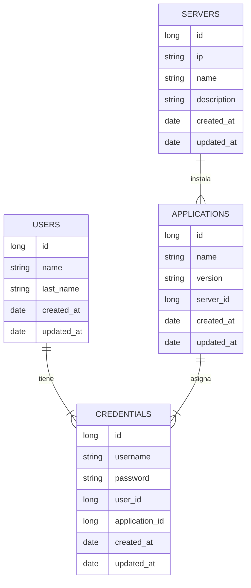

# API Para Administración de password en Aplicaciones
### Bedu JavaBE
### Descripción
El proyecto tiene como finalidad el desarrollo de un API rest para llevar el control de la asignación de credenciales (usuario y contraseña) de las apliaciones instaladas en un servidor. Dichas credenciales son asignadas a un usuario para su acceso al servidor y/o aplicación. Ej. un servidor A tiene instalado Glassfish Server y SSH, cada aplicación tiene su usuario y contraseña de acceso que serán asignados al usuario X.

### Objetivo
Aplicar los conocimientos adquiridos en el modulo de Springboot  y Java del curso de Bedu.

 - Patrones de diseño
 - JPA
 - JMS
 - Logs
 - Lombok
 - Mapstruct

### Diagrama E-R

### Rutas de cada recurso
| Recurso |verbo HTTP  |	Ruta |
|--|--|--|
| Servers |  GET| /servers |
|  |GET  | /servers/{id} |
|  |POST | /servers |
|  |PUT  |/servers/{id}  |
|  |DELETE  | /servers/{id} |
| Users | GET |/users  |
|  |GET  | /users/{id} |
|  |POST | /users |
|  |PUT  | /users/{id} |
|  |DELETE  | /users/{id} |
| Applications | GET  | /servers/{serverId}/applications |
|  |GET  | /servers/{serverId}/applications/{id} |
|  |POST | /servers/{serverId}/applications |
|  |PUT  | /servers/{serverId}/applications/{id} |
|  |DELETE  | /servers/{serverId}/applications/{id} |
| Credentials | GET | /users/{userId}/credentials |
|  |GET  | /users/{userId}/credentials/{id} |
|  |POST | /users/{userId}/applications/{applicationId}/credentials |
|  |PUT  | /users/{userId}/applications/{applicationId}/credentials |
|  |DELETE  | /users/{userId}/credentials/{id} |

